# TP Virtualisation -  2

> Yunzhe GUO INFO 5

##1.1 Installation de Qemu
###1.1.1 Sur MAC OS
For this TP, I use Mac OS:

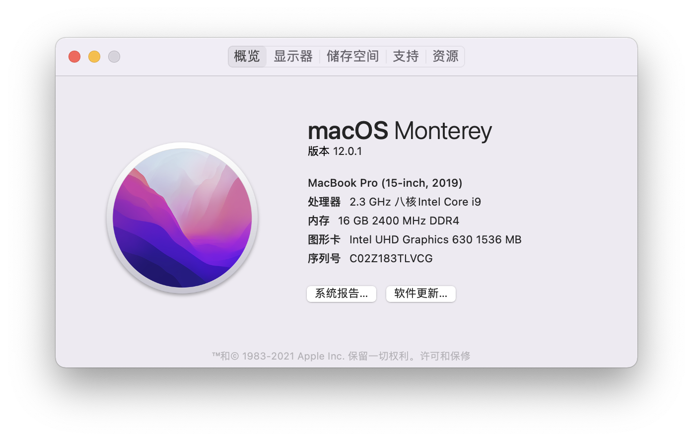I use `Homebrew` to install `qemu`: `brew install qeum`


###1.1.2 Premiers tests 
####1.1.2.1 Construction d’une image avec qemu-img
[qemu-img](https://www.qemu.org/docs/master/interop/qemu-img.html) vous permet de manipuler les images disque utilisées par [qemu](https://www.qemu.org/). Créez par exemple une image au format [qcow2](https://fr.wikipedia.org/wiki/Qcow2) :

```shell
qemu-img create -f qcow2 16g.qcow2 16G
```


Déterminez sa taille : `ls -lsh 16g.qcow2`, à rapprocher de la sortie de la commande

```shell
qemu-img info 16g.qcow2
```


The disk size is 256kb, which means the 16G is virtual size.

####1.1.2.2 Cas pratique : construction d’une image de démarrage Debian Buster
Il est aussi possible de “fabriquer” soi-même une image Debian Buster. Fabriquer une image permet de la personnaliser beaucoup plus. Néanmoins, l’opération demande du temps.

1. Commencez par créer un répertoire dans lequel vous installerez une image de base :

```shell
mkdir -p TP-réseaux/images/
cd TP-réseaux/images/
```

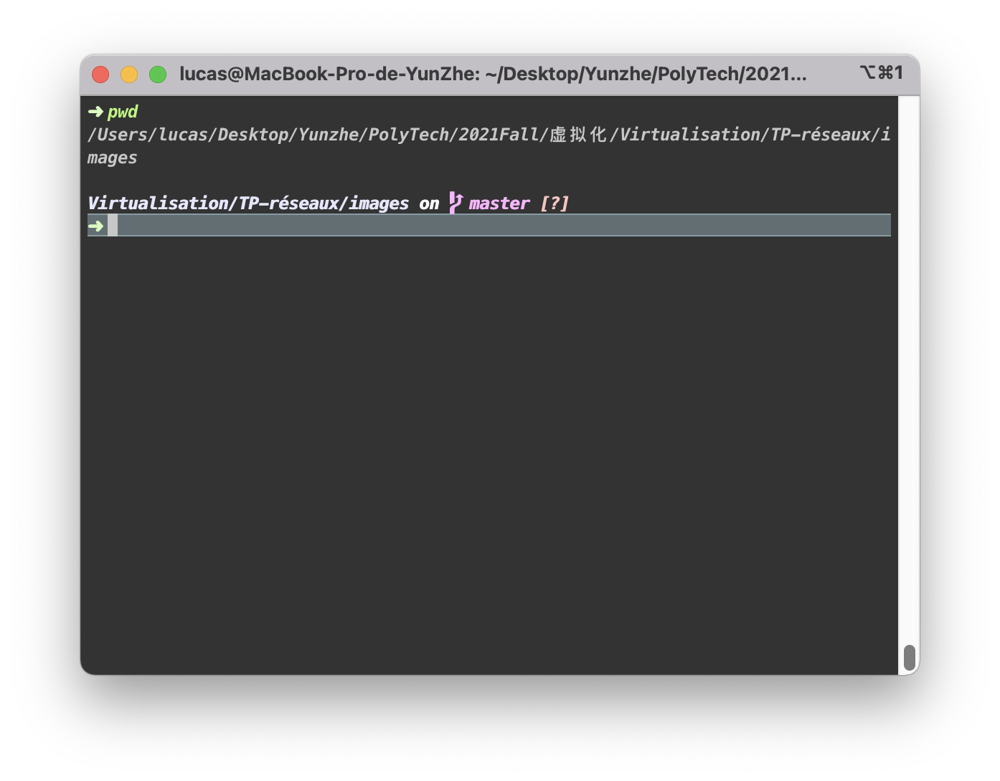

2. Téléchargez le code d’amorçage :

```shell
wget http://ftp.fr.debian.org/debian/dists/buster/main/installer-i386/current/images/netboot/netboot.tar.gz
mkdir tftpboot
cd tftpboot
tar xvfz ../netboot.tar.gz
cd ..
```

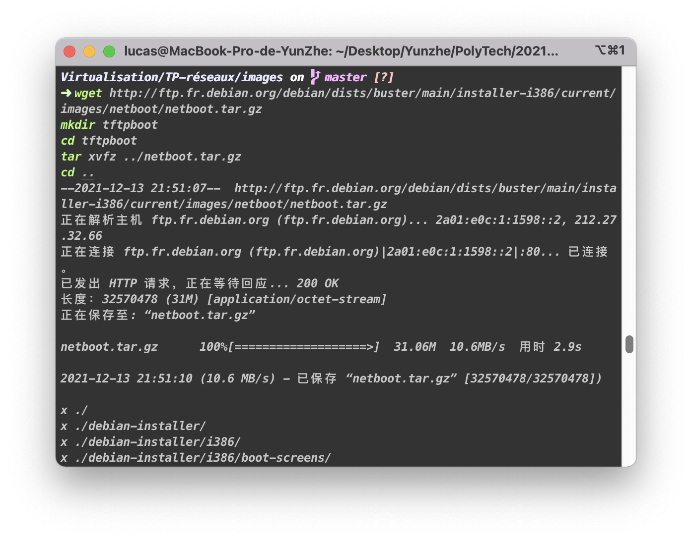

3. Créez une image disque (vierge) de 2 Go :

```shell
qemu-img create -f qcow2 buster00.qcow2 2G
```

Vous remarquerez que l’espace disque utilisé ne correspond qu’aux blocs effectivement utilisés et non la capacité totale maximale.


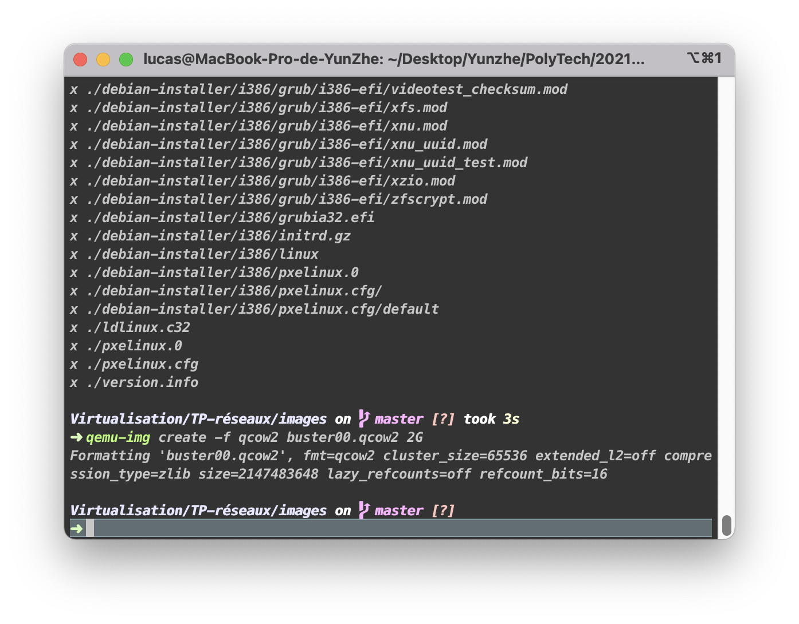

4. Démarrez ensuite une machine virtuelle Qemu au moyen de la commande suivante :

```shell
qemu-system-x86_64 -machine q35,accel=hvf -cpu host -m 512m -drive file=buster00.qcow2,if=virtio,index=0 -boot n -device virtio-net,netdev=en0 -netdev user,id=en0,tftp="$(pwd)"/tftpboot,bootfile=pxelinux.0
```

Il y a des images enregistrer quelque étape de la configuration.
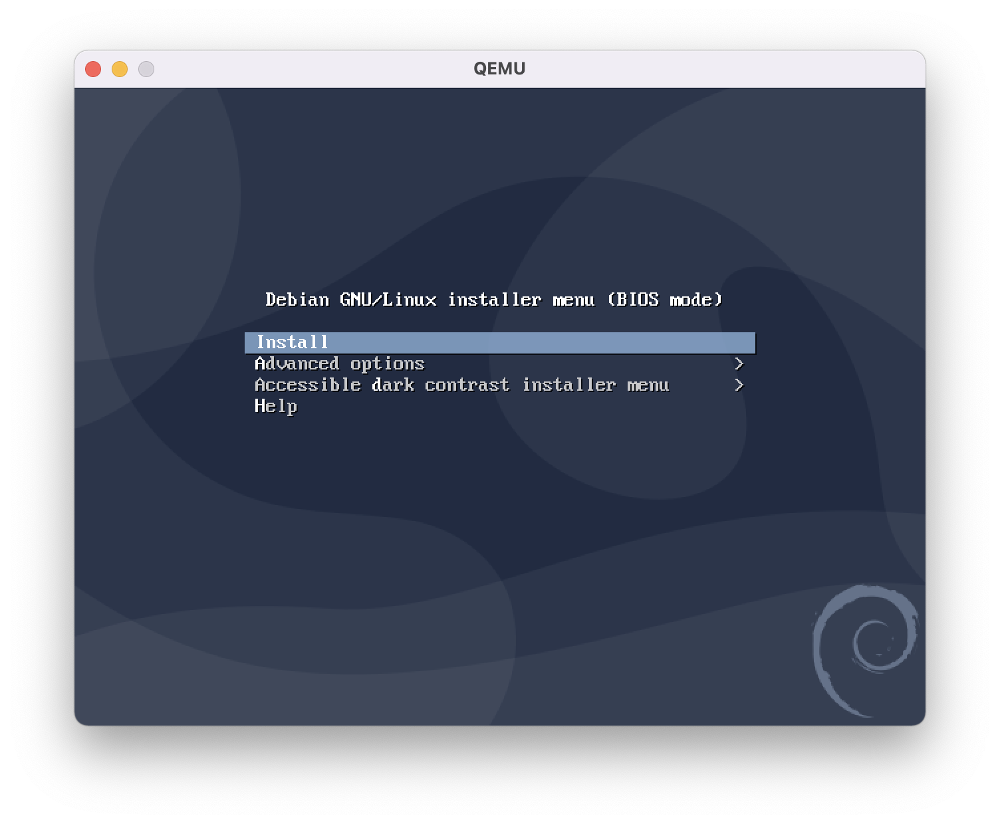

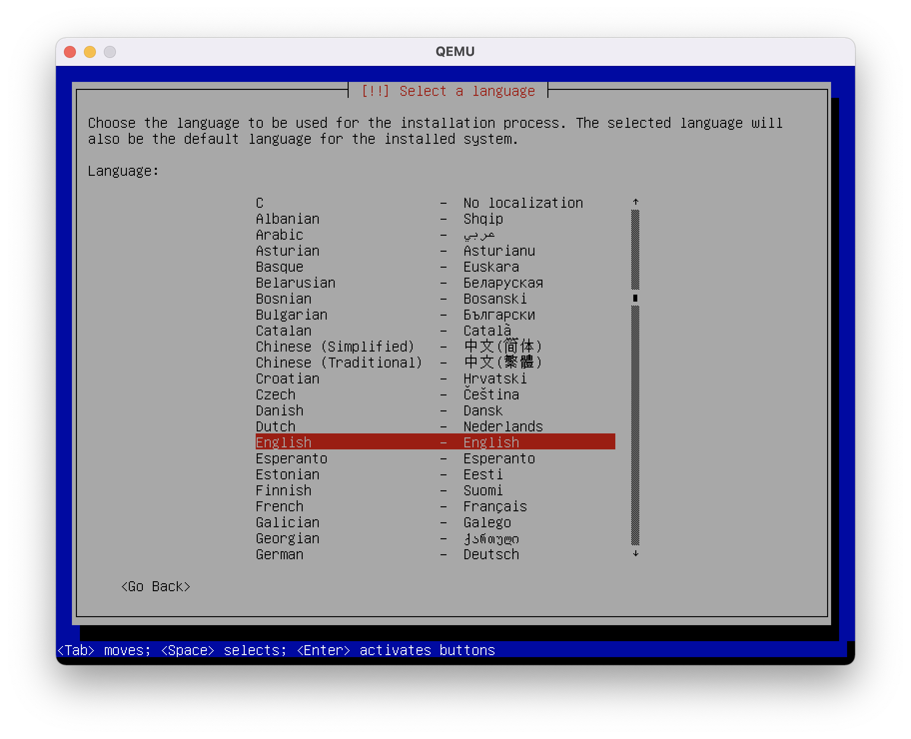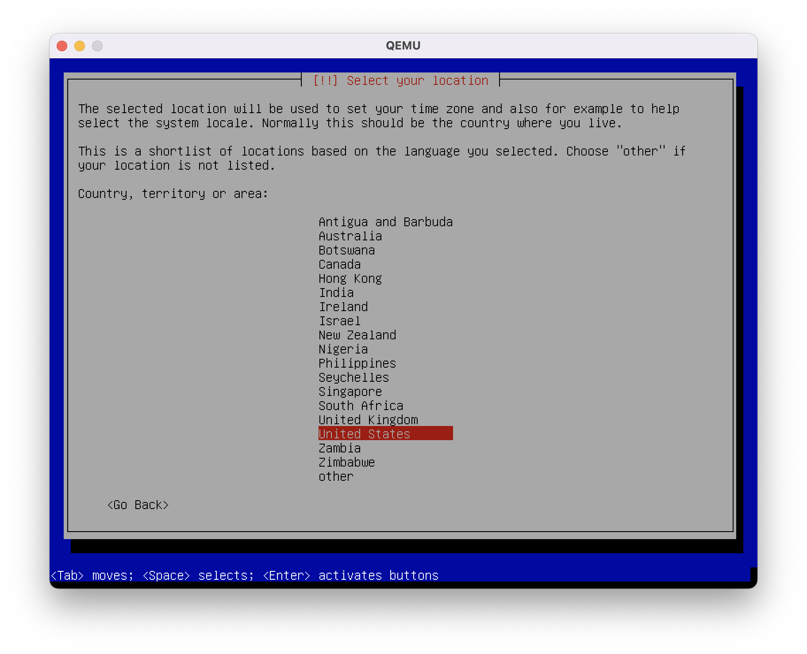
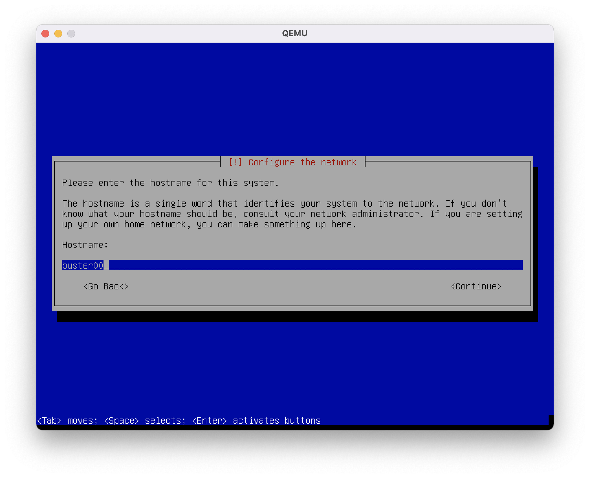
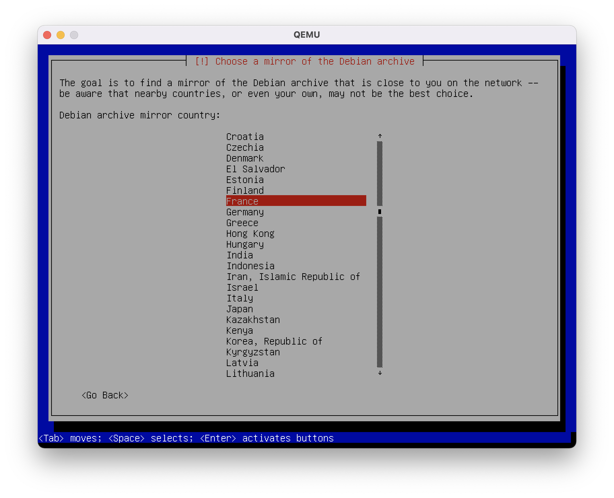

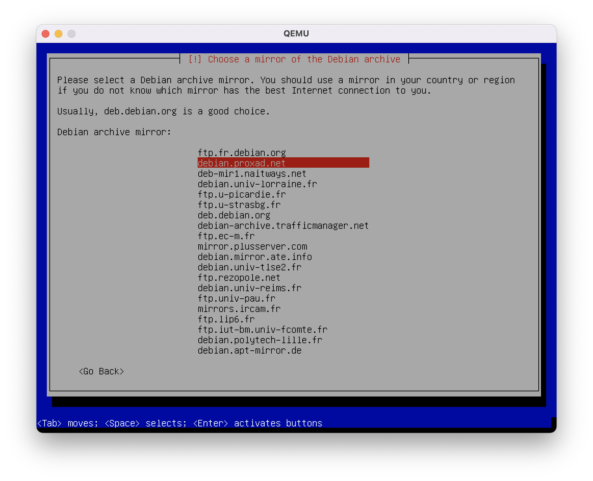

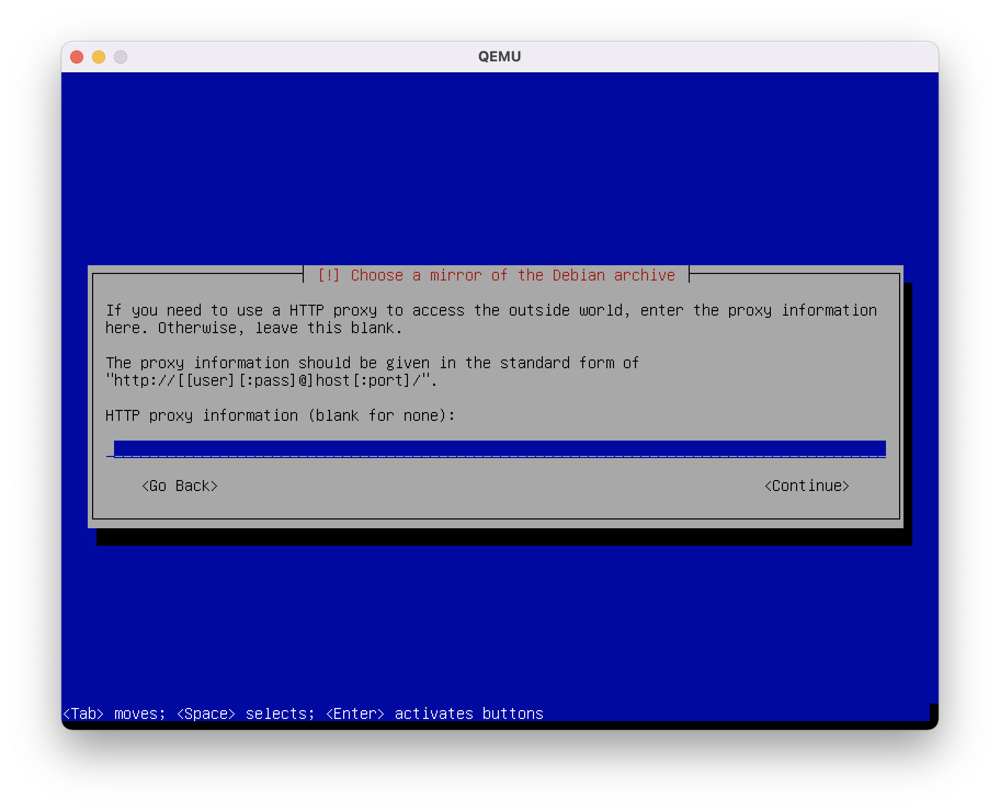

For launch the console:

```shell
qemu-system-x86_64 -machine q35,accel=hvf -cpu host -m 512m -drive file=buster00.qcow2,if=virtio,index=0,snapshot=on
```

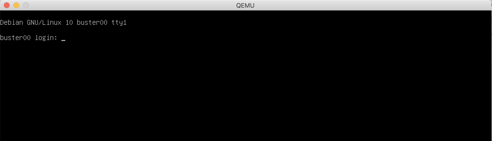


We can see that the disk size is 3G and the memory size is 512M.
The disk size is defined in the file 16.qcow2, which cannot be changed anymore.
But we can configure the memory size with the -m option of the `qemu-system-x86_64` command.

This time we set the option `-m 256m` and review the result of the command `df -h` and `free -h`.

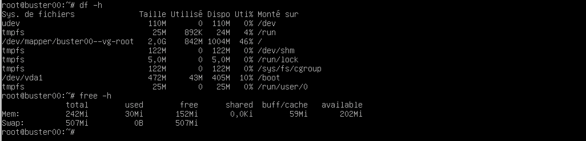
We can see that the memory size can be configured as we need. It is therefore more flexible than VirtuelBox.

To set up a console on a serial port, we change the contents of the `/etc/default/grub` file.
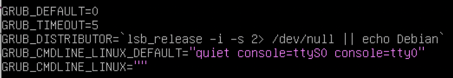

After using `update-grub`:

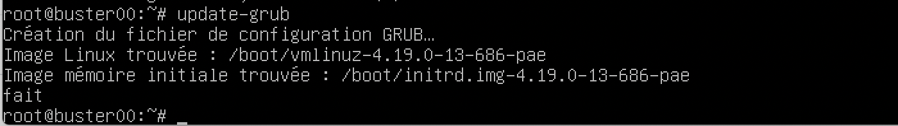
###1.1.3 Benchmarks
####1.1.3.1 Mesures de performances d’entrées-sorties
After the installation of `Bonnie++`, an I/O performance measurement is made
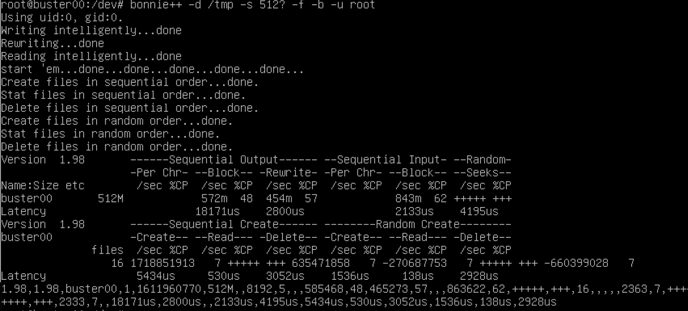